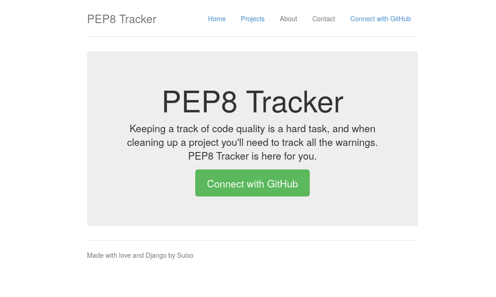
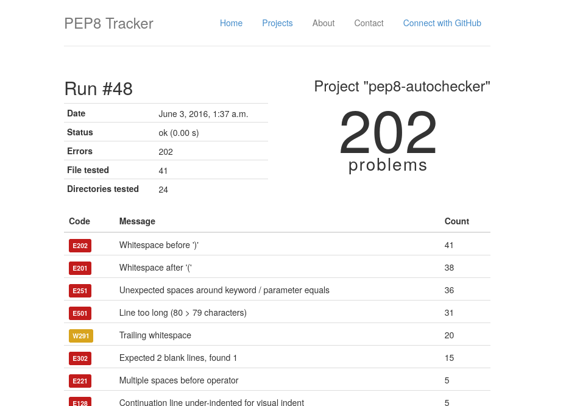
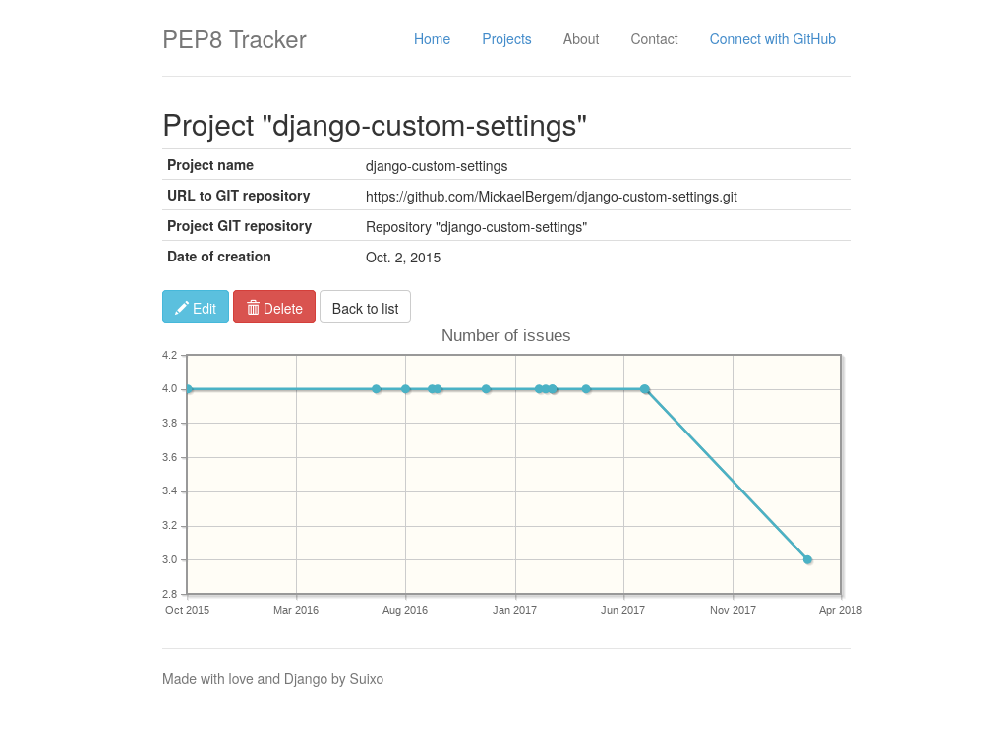

pep8-autochecker
================

Automated PEP8 review of Python projects

# Installation

Run the following commands :

    virtualenv env # If you don't want to use a virtualenv, go directly to the `pip install` command
    source bin/env/activate
    pip install -r requirements

To enable social accounts authentification, you should open the admin page (http://localhost:8000/admin/socialaccount/socialapp/) and add a social application (for example GitHub). You will need details (public and API keys) from the selected platform.

# Screenshots

**Landing page**:

---

**Example of scan results**:

**Details of a project**:

---

# Status

